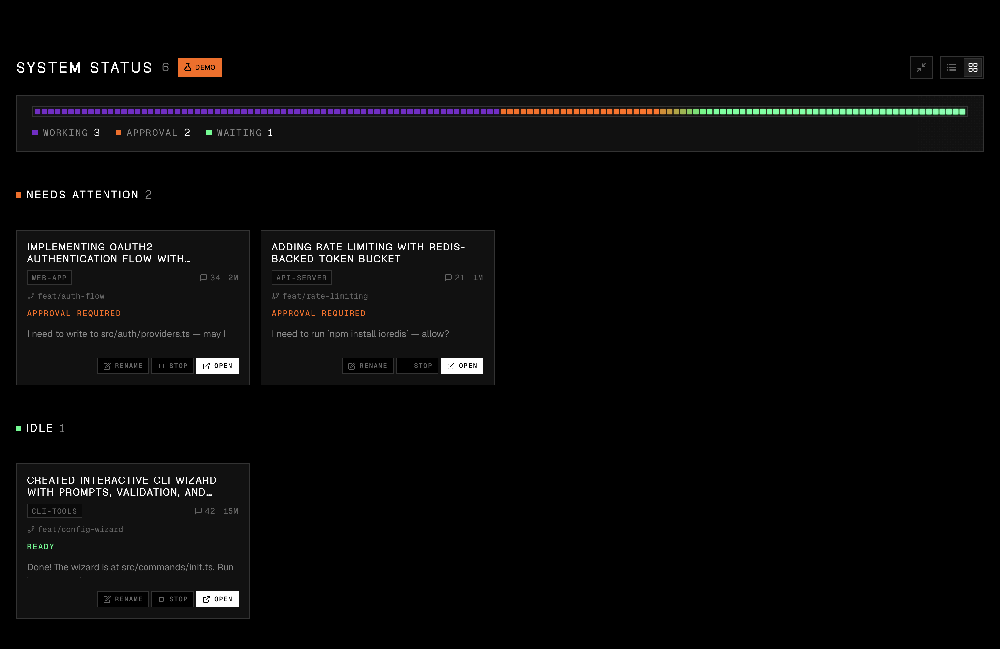
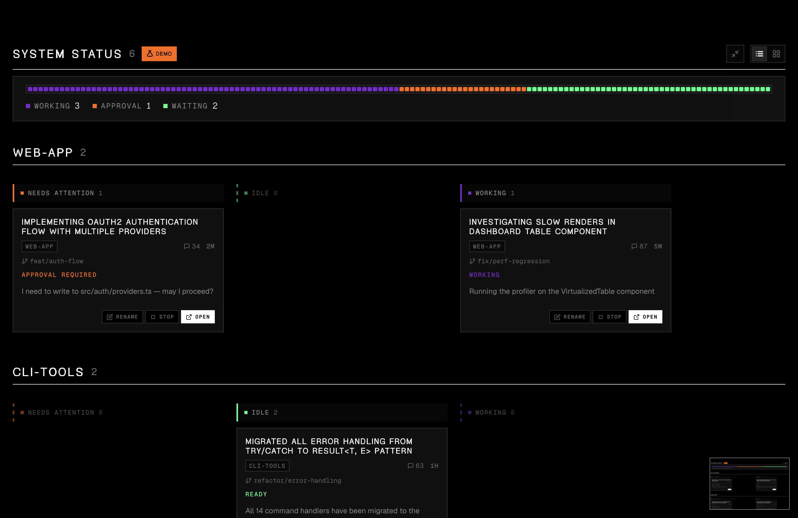
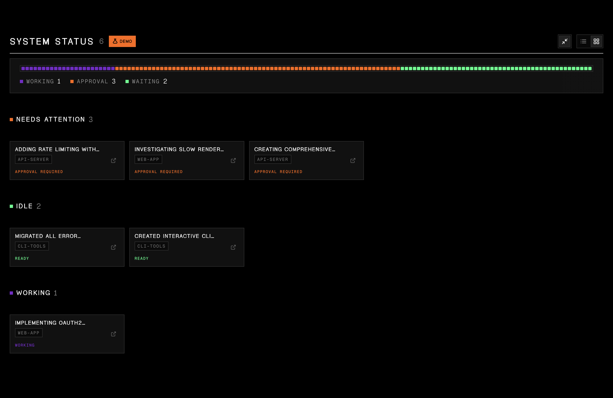
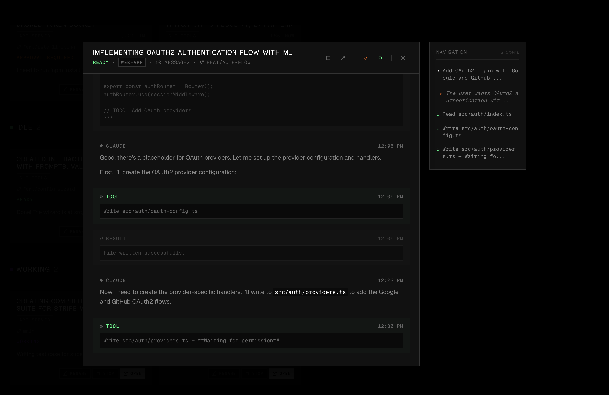

# c9watch

> Monitor and control all your Claude Code sessions from one place.

**c9watch** (short for **c**laude cod**e** watch, like k8s for Kubernetes) is a macOS desktop app that gives you a real-time dashboard of every Claude Code session running on your machine. No more switching between terminals to check which agent needs permission, which one is working, and which one is idle.

## Demo

[](https://youtu.be/9PdN7joYmUk)

## Works with everything. Tied to nothing.

Unlike other Claude Code management tools that require you to launch sessions from within their app, **c9watch doesn't care where you start your sessions**. It discovers them automatically by scanning running processes at the OS level.

Start Claude Code from any terminal or IDE you already use -- VS Code, Zed, iTerm2, Antigravity, you name it -- and c9watch picks them all up. No plugins to install. No workflows to change. No vendor lock-in.

Just open c9watch and see everything.

## Lightweight and fast.

Built with **Tauri**, **Rust**, and **Svelte** -- not Electron. The app binary is small, memory usage is minimal, and the UI stays snappy. Rust handles process scanning and file parsing at native speed. Svelte compiles away the framework overhead. You're already running multiple Claude Code agents eating up resources -- your monitoring tool shouldn't add to the pile.

## Install

### Quick install

```bash
curl -fsSL https://raw.githubusercontent.com/minchenlee/c9watch/main/install.sh | bash
```

### Download

Grab the latest `.dmg` from the [Releases](https://github.com/minchenlee/c9watch/releases) page.

### Build from source

Prerequisites: [Rust](https://rustup.rs/), [Node.js](https://nodejs.org/) (v18+), and the [Tauri CLI](https://v2.tauri.app/start/prerequisites/).

```bash
git clone https://github.com/minchenlee/c9watch.git
cd c9watch
npm install
npm run tauri build
```

The built `.app` will be in `src-tauri/target/release/bundle/macos/`.

## Screenshots

### Status view -- see what needs your attention first

Sessions grouped by status. Permission requests surface to the top so you never leave an agent stuck waiting.



### Project view -- organize by codebase

Sessions grouped by project, each with its own status columns. See what's happening across all your repos.



### Compact view -- monitor at a glance

Minimal cards for when you just need a quick status check without the details.



### Conversation viewer -- inspect any session

Expand any card to see the full conversation history with formatted code, tool usage, and a navigation map.



## Features

- **Zero-integration setup** -- Works with any terminal or IDE, no plugins or extensions required
- **Auto-discovery** -- Detects all running Claude Code sessions by scanning processes at the OS level
- **Real-time status** -- See at a glance which sessions are Working, Need Permission, or Idle
- **Conversation viewer** -- Expand any session to view the full conversation with formatted markdown and code blocks
- **Session control** -- Stop sessions, open their parent terminal/IDE, or rename them for easier tracking
- **Multi-project view** -- Sessions grouped by project with git branch info
- **Menu bar integration** -- Quick access from the macOS tray icon

## How it works

1. A background thread polls every 2 seconds, scanning for running `claude` processes using `sysinfo`
2. Each process is matched to its session file in `~/.claude/projects/` via path encoding and timestamp correlation
3. The last N entries of each session's JSONL file are parsed to determine status:
   - **Working** -- Claude is generating a response or executing tools
   - **Needs Permission** -- A tool is pending that requires user approval
   - **Idle** -- Session is waiting for your next prompt
4. Status updates are pushed to the Svelte frontend via Tauri events
5. The UI reactively updates, sorting sessions by priority (permission requests surface first)

## Tech stack

| Layer | Technology |
|-------|-----------|
| Desktop framework | [Tauri 2](https://v2.tauri.app/) |
| Frontend | [SvelteKit](https://svelte.dev/) + [Svelte 5](https://svelte.dev/docs/svelte/overview) |
| Backend | Rust |
| Process discovery | [sysinfo](https://crates.io/crates/sysinfo) |
| Design system | Vercel Noir (true black, [Geist](https://vercel.com/font) fonts) |

## Development

```bash
npm install
npm run tauri dev
```

This starts both the Vite dev server (hot-reload for the frontend) and the Tauri Rust backend.

### Project structure

```
c9watch/
├── src/                    # SvelteKit frontend
│   ├── routes/             # Pages (+page.svelte, +layout.svelte)
│   ├── lib/
│   │   ├── components/     # Svelte components (SessionCard, MessageBubble, etc.)
│   │   ├── stores/         # Reactive state management
│   │   ├── demo/           # Demo mode with mock data
│   │   ├── api.ts          # Tauri command wrappers
│   │   └── types.ts        # TypeScript types
│   └── app.css             # Global styles
├── src-tauri/              # Rust backend (Tauri)
│   └── src/
│       ├── lib.rs          # Tauri commands and app setup
│       ├── polling.rs      # Background session detection loop
│       ├── actions.rs      # Stop/open session actions
│       └── session/
│           ├── detector.rs # Process-to-session matching
│           ├── status.rs   # Status determination logic
│           ├── parser.rs   # JSONL file parsing
│           └── permissions.rs # Auto-approval rule checking
```

## Demo mode

Press `Cmd+D` to toggle demo mode, which loads simulated sessions with animated status transitions. Useful for testing the UI without running real Claude Code sessions.

## Contributing

Contributions are welcome! Please read [CONTRIBUTING.md](CONTRIBUTING.md) for guidelines on:
- Setting up the development environment
- Coding standards and commit message format
- Pull request process
- Platform-specific contributions (Windows, Linux)

## Contributors

Thanks to these wonderful people who have contributed to c9watch:

<!-- ALL-CONTRIBUTORS-LIST:START - Do not remove or modify this section -->
<!-- prettier-ignore-start -->
<!-- markdownlint-disable -->
<table>
  <tbody>
    <tr>
      <td align="center" valign="top" width="14.28%"><a href="https://github.com/minchenlee"><br /><sub><b>Min-Chen Lee</b></sub></a><br /><a href="#code-minchenlee" title="Code">💻</a> <a href="#doc-minchenlee" title="Documentation">📖</a> <a href="#design-minchenlee" title="Design">🎨</a></td>
      <td align="center" valign="top" width="14.28%"><a href="https://github.com/cynaptic"><br /><sub><b>Ray Lee</b></sub></a><br /><a href="#code-cynaptic" title="Code">💻</a> <a href="#platform-cynaptic" title="Platform">📦</a></td>
      <td align="center" valign="top" width="14.28%"><a href="https://github.com/grimmerk"><br /><sub><b>Grimmer Kang</b></sub></a><br /><a href="#code-grimmerk" title="Code">💻</a></td>
    </tr>
  </tbody>
</table>

<!-- markdownlint-restore -->
<!-- prettier-ignore-end -->

<!-- ALL-CONTRIBUTORS-LIST:END -->

See [CONTRIBUTORS.md](CONTRIBUTORS.md) for the full list and contribution details.

## License

MIT
